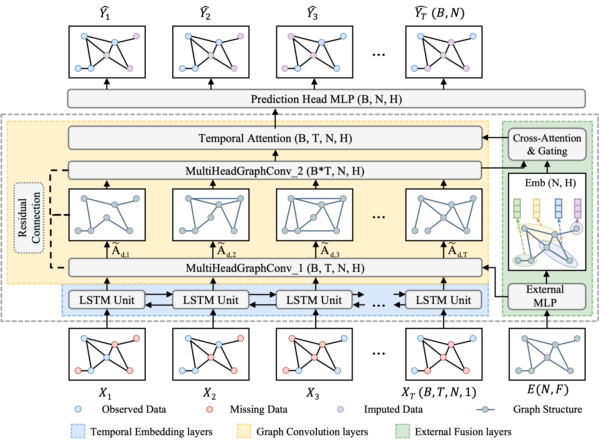
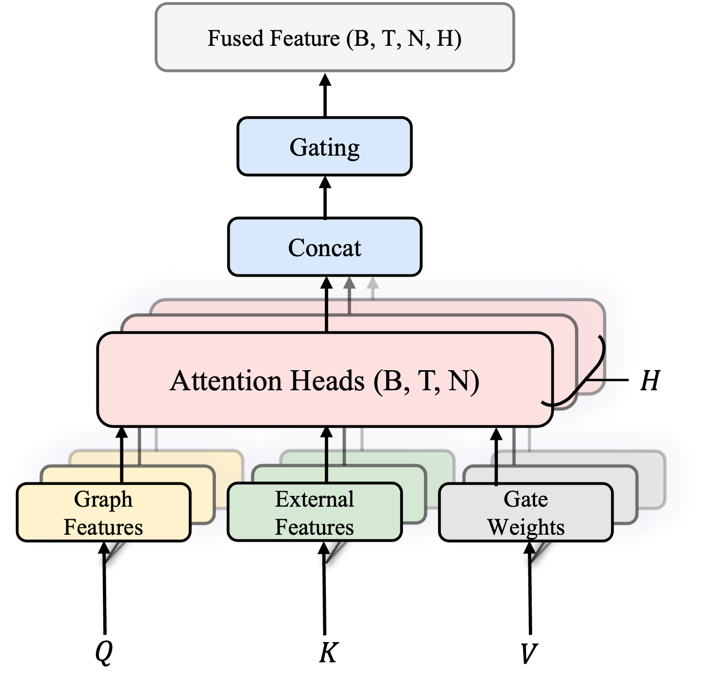
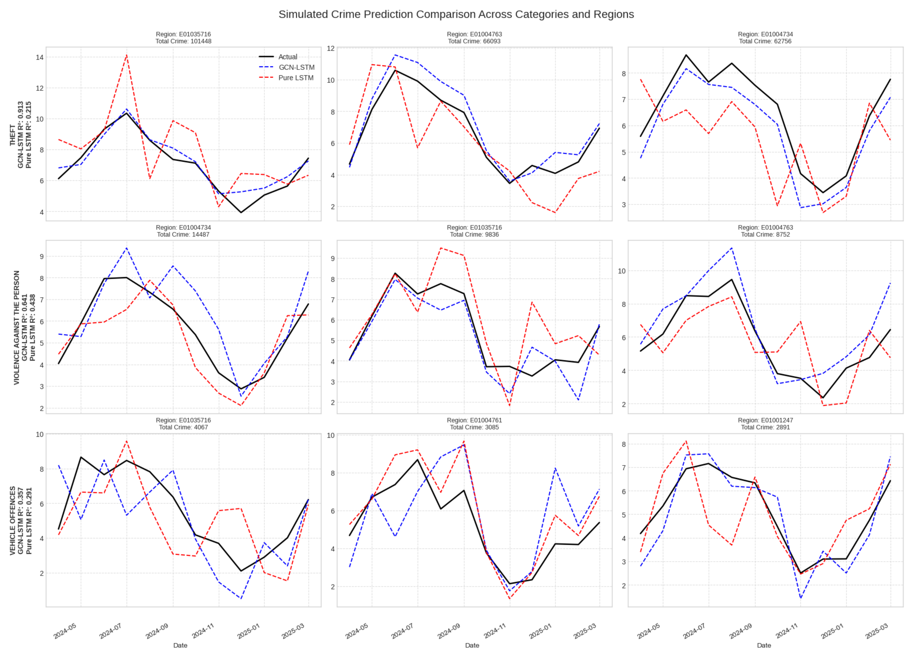
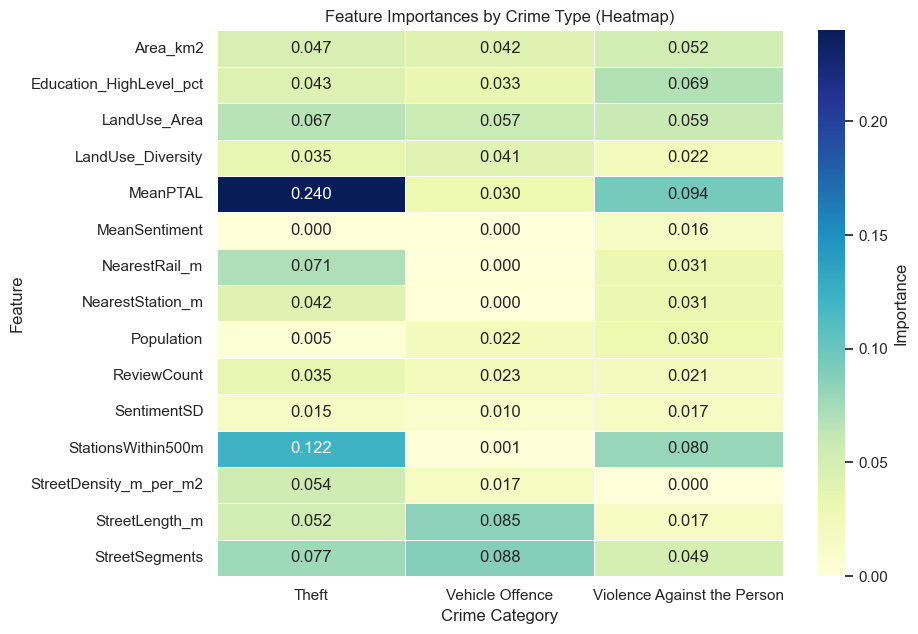

# Multimodal Spatio-Temporal Fusion: A Generalizable GCN-LSTM with Attention Framework for Urban Applications

[](LICENSE)
[](https://www.python.org/)

This repository contains the source code and data for the research paper **"Multimodal Spatio-Temporal Fusion: A Generalizable GCN-LSTM with Attention Framework for Urban Applications"**.

The project develops and evaluates a general-purpose, multimodal spatio-temporal deep learning framework for urban applications. The framework integrates a Graph Convolutional Network (GCN), a Long Short-Term Memory (LSTM) network, and attention mechanisms to model diverse urban phenomena.

## 📚 Citation

If you use this work in your research, please cite:

```bibtex
@article{#undo
}
```

### Institutional Affiliation
- **Institution**: University College London (UCL)
- **Department**: Centre for Advanced Spatial Analysis (CASA)
- **Research Group**: MRes Saptial Data Science & Visualization

---

**Last Updated**: September 2025  
**Version**: 0.9.9  

## Overview

<div align="center">
  
  <p><em>Figure 1: Research workflow overview</em></p>
</div>

## Abstract

Urban big data offers unprecedented opportunities for understanding cities, yet analytical methods remain fragmented and domain-specific. This research addresses this gap by developing and evaluating a **general-purpose, multimodal spatio-temporal deep learning framework** for urban applications.

### Key Innovation
The framework combines:
- **Graph Convolutional Networks (GCN)** for spatial dependency modeling
- **Long Short-Term Memory (LSTM)** networks for temporal dynamics
- **Attention mechanisms** for feature importance weighting

### Validation
Applied to two distinct urban prediction tasks in London:
1. **Crime Forecasting**: Monthly crime counts across categories
2. **Housing Price Estimation**: Quarterly median price changes

### Performance
- **34.15% MAE reduction** in crime prediction vs. LSTM baseline
- **R² = 0.910** for theft prediction (90%+ variance explained)
- **15.01% MAE improvement** in housing price estimation
- **R² = 0.801** for housing price prediction

The results validate that a single, adaptable architecture can effectively model diverse urban phenomena while providing transparency for real-world decision support.

## 🎯 Key Contributions

### 1. **Methodological Innovation**
- Novel hybrid GCN-LSTM-Attention framework engineered for cross-domain generalizability
- Integration of spatial, temporal, and multimodal data streams in unified architecture
- Scalable design applicable to diverse urban prediction tasks

### 2. **Empirical Validation** 
- First rigorous dual-domain validation of spatio-temporal framework
- Demonstrated superior performance across heterogeneous urban applications
- Comprehensive benchmarking against established baselines

### 3. **Practical Impact**
- Actionable interpretability through attention-based feature importance analysis
- Bridge between advanced predictive modeling and policy-relevant insights
- Open-source implementation for reproducible urban analytics

## 🗺️ Study Area

The framework was evaluated using data from **Greater London**, providing a robust testbed for urban analytics with:

- **Spatial Units**: 4,835 Lower Layer Super Output Areas (LSOAs)
- **Population**: ~9 million residents across diverse urban contexts  
- **Area Coverage**: 1,572 km² including central urban, suburban, and peripheral areas
- **Data Richness**: Comprehensive multimodal datasets spanning demographics, infrastructure, and socioeconomic indicators

<div align="center">
  
  <p><em>Figure 2: Lower Layer Super Output Areas (LSOAs) in Greater London study area</em></p>
</div>

### Why London?
London serves as an ideal testbed due to its:
- **Data Availability**: Rich, open datasets across multiple urban domains
- **Spatial Heterogeneity**: Diverse neighborhoods with varying characteristics
- **Policy Relevance**: Active urban planning and public safety initiatives
- **Scale**: Large enough for robust statistical analysis, manageable for computational resources

## 🏗️ Framework Architecture

The model architecture is a **hybrid system** designed to process and fuse spatial, temporal, and external feature information through multiple interconnected components, enabling generalization across diverse urban prediction tasks.

<div align="center">
  
  <p><em>Figure 3: Detailed architecture of the spatio-temporal GCN-LSTM framework with attention mechanisms</em></p>
</div>

<div align="center">
  
  <p><em>Figure 4: High-level model structure and component relationships</em></p>
</div>

### 🔧 Key Components

#### 1. **Input Processing Layer**
- **Temporal Embeddings**: Projects time-series data into high-dimensional latent space
- **Static Feature Encoding**: Processes external features (demographics, geography, etc.)
- **Feature Normalization**: Ensures consistent scales across heterogeneous data types

#### 2. **Spatio-Temporal Fusion Block**
- **Multi-Head Graph Convolution**: 
  - Captures complex spatial dependencies via geographic proximity graph
  - Multiple attention heads learn different spatial relationship patterns
  - Incorporates neighborhood effects and spatial spillovers

- **Gating Mechanism**: 
  - Adaptive fusion of spatially-aware representations with static features
  - Learns optimal combination weights for different feature types
  - Prevents information loss during feature integration

- **LSTM Temporal Modeling**:
  - Models temporal dynamics from fused spatial-feature representations  
  - Captures both short-term fluctuations and long-term trends
  - Maintains temporal context across prediction horizons

#### 3. **Attention & Prediction Layer**
- **Temporal Attention Mechanism**: 
  - Dynamically weights importance of different time steps
  - Focuses on most relevant historical periods for prediction
  - Provides interpretability for temporal dependencies

- **Multi-Layer Prediction Head**: 
  - Final MLP generates predictions for target variables
  - Dropout regularization prevents overfitting
  - Flexible output layer adapts to different prediction tasks

<div align="center">
  
  <p><em>Figure 5: Cross-attention mechanism for temporal importance weighting</em></p>
</div>

### 📚 Theoretical Foundation

<div align="center">
  
  <p><em>Figure 6: Conceptual diagram of Graph Convolutional Network operations (Kipf & Welling, 2017)</em></p>
</div>

The framework builds upon established deep learning paradigms:
- **Graph Neural Networks**: Spatial relationship modeling in non-Euclidean domains
- **Recurrent Networks**: Sequential pattern learning for temporal dependencies  
- **Attention Mechanisms**: Selective focus and interpretability enhancement
- **Multi-Task Learning**: Shared representations across domain applications

## 📊 Case Studies

The framework's **generalizability** was rigorously tested across two heterogeneous urban prediction domains, demonstrating cross-domain applicability and robust performance.

### 🚔 Case Study 1: Urban Crime Forecasting (`ex1_crime/`)

**Objective**: Predict monthly crime counts across three major categories
- **Theft**: Property crimes, burglary, shoplifting
- **Vehicle Offences**: Car theft, vehicle interference  
- **Violence Against the Person**: Assault, harassment, threats

**Data Characteristics**:
- **Temporal Resolution**: Monthly aggregation (2019-2023)
- **Spatial Coverage**: All 4,835 London LSOAs
- **Target Variable**: Crime count per LSOA per month
- **Challenge**: High variability, seasonal patterns, spatial clustering

<div align="center">
  
  <p><em>Figure 7: Temporal trends in crime categories across London showing seasonal patterns and COVID-19 impact</em></p>
</div>

### 🏠 Case Study 2: Housing Price Estimation (`ex2_housing/`)

**Objective**: Estimate quarterly median housing prices at LSOA level
- **Market Dynamics**: Supply-demand interactions, gentrification effects
- **Spatial Spillovers**: Neighborhood price influences and contagion
- **Economic Factors**: Interest rates, policy changes, market sentiment

**Data Characteristics**:
- **Temporal Resolution**: Quarterly aggregation (2019-2023)
- **Spatial Coverage**: All 4,835 London LSOAs  
- **Target Variable**: Median house price per LSOA per quarter
- **Challenge**: Non-linear price dynamics, spatial autocorrelation, market volatility

<div align="center">
  
  <p><em>Figure 8: London house price trends over time showing market cycles and regional variations</em></p>
</div>

### 🔄 Cross-Domain Validation Strategy

| Aspect | Crime Forecasting | Housing Estimation |
|--------|-------------------|-------------------|
| **Temporal Pattern** | High-frequency, seasonal | Low-frequency, cyclical |
| **Spatial Structure** | Clustered hotspots | Smooth gradients |  
| **Feature Importance** | Demographics, accessibility | Economics, amenities |
| **Interpretability** | Policy intervention points | Market drivers |

This dual-domain approach ensures the framework's **robustness** across different:
- **Data distributions** (count vs. continuous)
- **Temporal dynamics** (monthly vs. quarterly)  
- **Spatial patterns** (clustered vs. smooth)
- **Domain knowledge** (criminology vs. economics)

## 📊 Dataset

A core innovation of this research is the **principled data fusion pipeline** that integrates heterogeneous urban datasets into a unified, model-ready feature matrix at the LSOA level. This comprehensive dataset enables robust spatio-temporal modeling across diverse urban applications.

<div align="center">
  
  <p><em>Figure 9: Multimodal data processing pipeline for integrating diverse urban datasets</em></p>
</div>

### 🏗️ Feature Engineering

The integrated dataset comprises **15 static external features** spanning multiple urban domains.

<div align="center">
  
  <p><em>Figure 10: Feature correlation heatmap revealing multi-dimensional urban relationships</em></p>
</div>

**Key Insights from Correlation Analysis**:
- **Transport-Demographics**: Strong correlation between accessibility and population density
- **Network-Economic**: Street connectivity correlates with housing prices
- **Sentiment-Safety**: Public sentiment negatively correlates with crime rates
- **Geographic Constraints**: Area size inversely related to urban intensity metrics

### 📈 Target Variables

#### **Crime Data** (`ex1_crime/`)
- **Source**: Metropolitan Police Service open data
- **Temporal Coverage**: 2019-2023 (monthly)
- **Categories**: Theft, Vehicle Offences, Violence Against Person
- **Preprocessing**: Spatial aggregation to LSOA, outlier detection, missing value imputation

#### **Housing Prices** (`ex2_housing/`)
- **Source**: UK Land Registry, Rightmove, Zoopla
- **Temporal Coverage**: 2019-2023 (quarterly)
- **Metric**: Median house prices per LSOA
- **Preprocessing**: Price normalization, seasonal adjustment, market trend removal

### 📁 Dataset Statistics

- **Spatial Units**: 4,835 LSOAs
- **Temporal Points**: 48 months (crime) / 16 quarters (housing)
- **Feature Dimensions**: 15 static + temporal targets

## ⚙️ Model Details

### 🏗️ Architecture Specifications

#### **Layer-by-Layer Architecture Breakdown**

<div align="center">

**Table 2: Model Architecture Breakdown**

</div>

| # | Layer (Type) | Input Shape | Output Shape | Details |
|---|--------------|-------------|--------------|---------|
| 1 | Temporal Embedding (Linear) | (B, T, N, 1) | (B, T, N, 64) | Projects 1D sequence into 64D latent space |
| 2 | External Embedding (MLP) | (N, F) | (N, 64) | Embeds static features into 64D space |
| - | Initial Reshape | (B, T, N, 64) | (B×T, N, 64) | Flattens batch and time dimensions |
| 3 | MultiHeadGraphConv 1 | (B×T, N, 64) | (B×T, N, 64) | 1st GCN block (4 heads) with residual connection |
| 4 | MultiHeadGraphConv 2 | (B×T, N, 64) | (B×T, N, 64) | 2nd GCN block (4 heads) captures 2-hop relations |
| - | Temporal Reshape | (B×T, N, 64) | (B, T, N, 64) | Restores temporal dimension for fusion |
| 5 | Cross-Attention & Gating | (B, T, N, 64) | (B, T, N, 64) | Fuses external embedding into the sequence |
| 6 | LSTM | (B, T, N, 64) | (B, T, N, 128) | Processes sequence to capture temporal dynamics |
| 7 | Temporal Attention | (B, T, N, 128) | (B, N, 128) | Aggregates information across time |
| 8 | Prediction Head (MLP) | (B, N, 128) | (B, N, 1) | Two-layer MLP (128→32→1) for final prediction |

**Notation**: B = Batch size, T = Time steps, N = Number of nodes (LSOAs), F = Feature dimensions

#### **Computational Requirements**
- **Training Time**: 
  - Crime Model: 150 minutes (NVIDIA A100 GPU) + 600 minutes (Google Colab TPU v6e-1)
  - Housing Model: 60 minutes (NVIDIA A100 GPU)
- **Memory Usage**: 40GB(GPU) 200GB(TPU) RAM during training

### 🔬 Implementation Details

#### **Graph Construction**
- **Spatial Graph**: K-nearest neighbors (k=8) based on geographic distance
- **Edge Weights**: Inverse distance weighting with gaussian kernel
- **Graph Preprocessing**: Laplacian normalization for stable training
- **Dynamic Edges**: Optional temporal edge reweighting based on feature similarity

#### **Data Preprocessing Pipeline**
1. **Spatial Aggregation**: Point data → LSOA polygons using spatial joins
2. **Temporal Alignment**: Irregular timestamps → regular monthly/quarterly grids  
3. **Feature Scaling**: Min-max normalization with outlier clipping (±3σ)
4. **Missing Data**: Spatial interpolation followed by temporal forward-fill
5. **Graph Augmentation**: Random edge dropout (10%) during training for robustness

#### **Training Strategy**
- **Loss Weighting**: Adaptive loss balancing for multi-scale targets
- **Curriculum Learning**: Progressive increase in sequence length  
- **Data Augmentation**: Temporal jittering, spatial noise injection
- **Validation**: Time-series cross-validation with walk-forward approach

## 📁 Repository Structure

```
CASA0004/
├── 📊 data&preprocessing/           # Data pipeline and feature engineering
│   ├── data_combination_clean.ipynb     # Main data processing notebook
│   ├── gcn_feature_matrix_optimal.csv  # Final model-ready dataset
│   ├── feature_heatmap.ipynb           # Feature analysis and visualization
│   ├── create_core_requirements.py     # Environment management
│   └── [subdirectories]/               # Raw data organized by theme
│       ├── economic/                    # Economic indicators
│       ├── Infrastructure/              # Transport and utilities
│       ├── landuse/                     # Land use classifications  
│       ├── social/                      # Demographics and social data
│       └── shapefiles/                  # Spatial boundary files
│
├── 🚔 ex1_crime/                   # Crime forecasting experiment
│   ├── crime_final.ipynb               # Streamlined crime analysis  
│   ├── DSSS_cw_24044734.ipynb         # Complete research notebook
│   ├── crime_ml.ipynb                  # Model development and testing
│   ├── crime_data/                     # Crime-specific datasets
│   └── saved_models/                   # Trained model checkpoints
│
├── 🏠 ex2_housing/                 # Housing price estimation experiment  
│   ├── housing_final.ipynb             # Housing analysis and modeling
│   └── housing_test.ipynb              # Model validation experiments
│
├── 📈 graph&output/                # Visualizations and results
│   ├── [architecture_diagrams]/        # Framework visualization
│   ├── [performance_plots]/            # Results and metrics
│   └── [analysis_figures]/             # Feature analysis plots
│
├── 📋 README_files/                # Documentation assets
└── 📄 [root_files]                 # Project metadata
    ├── README.md                       # This documentation  
    ├── LICENSE                         # MIT License
    └── README.html                     # HTML version
```

### 🔧 Key Files Description

| File/Directory | Purpose | Key Outputs |
|----------------|---------|-------------|
| `data_combination_clean.ipynb` | Master data pipeline | Feature matrices, documentation |
| `crime_final.ipynb` | Crime model implementation | Performance metrics, predictions |  
| `housing_final.ipynb` | Housing model implementation | Price estimates, validation results |
| `gcn_feature_matrix_optimal.csv` | Model-ready dataset | 15 features × 4,835 LSOAs |
| `saved_models/` | Trained checkpoints | Deployable model weights |

## 🚀 Setup and Usage

### 📋 Prerequisites

#### **System Requirements**
- **Python**: 3.8+ (recommended: 3.9 or 3.10)
- **Memory**: Google Colab recommended for full dataset

#### **Software Dependencies**
- **Deep Learning**: PyTorch, PyTorch Geometric for GNN implementation  
- **Geospatial**: GeoPandas, Shapely, Folium for spatial analysis
- **Data Science**: NumPy, Pandas, Scikit-learn, Matplotlib, Seaborn

### ⚡ Quick Start

#### 1. **Clone Repository**
```bash
git clone https://github.com/IflyNY2PR/CASA0004.git
cd CASA0004
```

#### 2. **Environment Setup**
```bash
# Create virtual environment (recommended)
python -m venv casa0004_env
source casa0004_env/bin/activate  # On Windows: casa0004_env\Scripts\activate

# Install dependencies
pip install -r data&preprocessing/data_science_core_requirements_latest.txt

# Verify installation
python -c "import torch, torch_geometric; print('Setup successful!')"
```

#### 3. **Data Preparation** 
```bash
# Navigate to data processing
cd data&preprocessing/

# Run data pipeline (optional - processed data included)
jupyter notebook data_combination_clean.ipynb
```

#### 4. **Model Execution**
```bash
# Crime forecasting
cd ex1_crime/
jupyter notebook crime_final.ipynb

# Housing price estimation  
cd ex2_housing/
jupyter notebook housing_final.ipynb
```

## 📈 Results

The framework was rigorously evaluated through comprehensive ablation studies across two distinct urban prediction tasks, demonstrating both high accuracy and cross-domain generalizability. The results provide compelling evidence for the effectiveness of the unified spatio-temporal architecture.

### 🚔 Case Study I: Urban Crime Forecasting

The first validation tested the framework's ability to predict monthly crime counts for three prevalent categories: **Theft**, **Vehicle Offences**, and **Violence Against the Person**. These categories exhibit unique, non-stationary temporal trends with varying degrees of seasonality and volatility.

#### **Quantitative Performance**

The ablation study results provide definitive evidence of the framework's effectiveness, with hierarchical performance improvements across all metrics:

| Crime Category | Pure LSTM | No Ext. Adjacency | **Full Model** | MAE Improvement |
|----------------|-----------|-------------------|----------------|-----------------|
| **Theft** | MAE: 2.44, RMSE: 16.90 | MAE: 1.95, RMSE: 5.61 | **MAE: 1.61, RMSE: 4.33** | **34.15%** |
| **Violence** | MAE: 1.97, RMSE: 3.32 | MAE: 1.88, RMSE: 2.62 | **MAE: 1.73, RMSE: 2.51** | **12.23%** |
| **Vehicle Offences** | MAE: 1.16, RMSE: 1.65 | MAE: 1.14, RMSE: 1.58 | **MAE: 1.13, RMSE: 1.53** | **1.94%** |

**Key Findings:**
- **Hierarchical Improvement**: Introduction of multimodal features reduces MAE by ~20%, followed by spatial modeling providing additional ~18% improvement for theft
- **Task Dependency**: Spatial graph contribution varies significantly by crime type (17.67% for theft vs 0.55% for vehicle offences)
- **Exceptional Accuracy**: R² of 0.910 for theft prediction, explaining over 90% of the variance

<div align="center">
  
  <p><em>Figure 11: Scatter plot showing strong linear relationship between predicted and actual theft counts (R² = 0.910)</em></p>
</div>

#### **Model Validation and Generalization**

<div align="center">
  
  <p><em>Figure 12: Time-series comparison showing Full Model predictions (blue dashed) closely tracking actual values (black solid) versus Pure LSTM baseline (red dashed) across nine LSOA examples</em></p>
</div>

The training process demonstrates excellent convergence without overfitting:

<div align="center">
  
  <p><em>Figure 13: Training and validation loss curves showing smooth convergence over 100 epochs with no signs of overfitting</em></p>
</div>

### 🏠 Case Study II: Housing Price Estimation

To validate generalizability, the framework was adapted to predict quarterly median house prices—a phenomenon with distinct temporal signatures compared to crime data.

#### **Cross-Domain Performance**

| Model Variant | MAE (£) | RMSE (£) | R² | Improvement |
|---------------|---------|----------|----| ------------|
| Pure LSTM | 94,081 | 174,180 | 0.7557 | Baseline |
| No External Adjacency | 82,781 | 165,915 | 0.7783 | 12.01% |
| **Full Model** | **79,963** | **157,189** | **0.8010** | **15.01%** |

**Key Insights:**
- **Successful Adaptation**: Framework effectively captures spatial spillover effects in property markets
- **Spatial Value**: Clear improvement from No Adjacency to Full Model confirms spatial dependencies
- **Strong Performance**: R² of 0.801 explains 80%+ of price variance
- **Feature Dominance**: Multimodal features provide larger gains (12.01%) than spatial graph (3.40%)

### 🔍 Component Contribution Analysis

A systematic analysis quantified the value added by each architectural component, revealing fundamental differences in urban phenomena:

| Prediction Task | Feature Improvement | Spatial Improvement | Overall Improvement |
|----------------|-------------------|-------------------|-------------------|
| **Theft** | 20.02% | 17.67% | **34.15%** |
| **Violence** | 4.80% | 7.80% | **12.23%** |
| **Vehicle Offences** | 1.39% | 0.55% | **1.94%** |
| **Housing Prices** | 12.01% | 3.40% | **15.01%** |

**Phenomenon Classification:**
- **Feature-Dominant** (Housing): Intrinsic area characteristics drive prediction (hedonic model)
- **Balanced** (Theft): Equal contribution from features and spatial contagion
- **Spatial-Dominant** (Violence): Geographic proximity more predictive than static features
- **Resilient** (Vehicle Offences): Less dependent on modeled factors, suggesting other dynamics

### 🎯 Interpretability Analysis

The framework provides actionable insights through attention-based feature importance analysis, generating distinct "feature fingerprints" for different urban phenomena:

<div align="center">
  
  <p><em>Figure 14: Feature importance heatmap revealing distinct patterns across crime categories and geographic contexts</em></p>
</div>

**Theft Predictions** - Transport-Centric Profile:
- **MeanPTAL** (0.240): Highest importance - transport hubs concentrate victims and provide escape routes
- **StationsWithin500m** (0.122): Reinforces transport accessibility theory
- **Policy Implication**: Focus security resources on high-accessibility areas

**Vehicle Offences** - Infrastructure-Centric Profile:
- **StreetSegments** (0.088): Complex street networks provide more parking opportunities
- **StreetLength_m** (0.085): Longer street networks correlate with vehicle density
- **Policy Implication**: Enhanced surveillance in areas with complex street layouts

**Violence Against Person** - Socioeconomic-Centric Profile:
- **MeanPTAL** (0.094): Transport accessibility remains important
- **Education_HighLevel_pct** (0.069): Educational attainment inversely related to violence
- **Land Use Features**: Mixed land use creates interaction opportunities
- **Policy Implication**: Multi-faceted interventions addressing social and environmental factors
