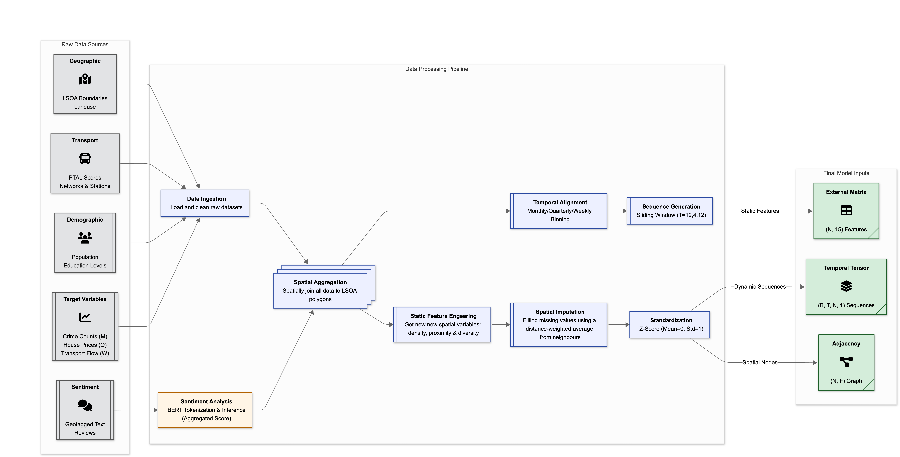

# Multimodal Spatio-Temporal Fusion: A Generalizable GCN-LSTM with Attention Framework for Urban Applications

[](LICENSE)
[](https://www.python.org/)

This repository contains the source code and data for the research paper **"Multimodal Spatio-Temporal Fusion: A Generalizable GCN-LSTM with Attention Framework for Urban Applications"**.

The project develops and evaluates a general-purpose, multimodal spatio-temporal deep learning framework for urban applications. The framework integrates a Graph Convolutional Network (GCN), a Long Short-Term Memory (LSTM) network, and attention mechanisms to model diverse urban phenomena.

## 📚 Citation

The work has been published in **Information Fusion (2026)**.

If you use this work in your research, please cite:

> Yunfei Guo, Multimodal Spatio-Temporal Fusion: A Generalizable GCNLSTM with Attention Framework for Urban Application, Information Fusion (2026), doi: [10.1016/j.inffus.2026.104164](https://doi.org/10.1016/j.inffus.2026.104164)

```bibtex
@article{Guo2026Multimodal,
  title = {Multimodal Spatio-Temporal Fusion: A Generalizable GCNLSTM with Attention Framework for Urban Application},
  author = {Guo, Yunfei},
  journal = {Information Fusion},
  year = {2026},
  doi = {10.1016/j.inffus.2026.104164},
  url = {https://doi.org/10.1016/j.inffus.2026.104164}
}
```

### Author Information
- **Author**: Yunfei Guo
- **ORCID**: 0009-0002-1466-5807
- **Email**: ucbvuoi@ucl.ac.uk / ssyyg6@gmail.com
- **Institution**: University College London (UCL)
- **Department**: Centre for Advanced Spatial Analysis (CASA)
- **Address**: 90 Tottenham Court Road, London, W1T 4TJ, United Kingdom
---

**Last Updated**: January 2026  
**Manuscript Status**: Published in Information Fusion (2026) 


## 🧭 Pipeline-First Repository Navigation

To match the workflow

**CSV Files → Load Data → Normalize Data → Create Graph (Adjacency Matrix) → Temporal Embedding → GCN → LSTM → Attention → Prediction**,

a dedicated pipeline-oriented structure is now available under [`pipeline/`](pipeline/):

- `pipeline/01_load_data/`
- `pipeline/02_normalize_data/`
- `pipeline/03_create_graph_adjacency_matrix/`
- `pipeline/04_temporal_embedding/`
- `pipeline/05_gcn_spatial_learning/`
- `pipeline/06_lstm_time_learning/`
- `pipeline/07_attention/`
- `pipeline/08_prediction/`

Each stage README points to the existing notebooks, scripts, and datasets in this repository so you can follow the pipeline end-to-end without breaking prior file paths.

Pipeline stages also include `links/` subfolders with symlinks to key source notebooks/data/model artifacts, so files are organized by step while remaining in their original canonical locations.

## Overview

<div align="center">
  
  <p><em>Figure 1: Research workflow overview</em></p>
</div>

## Abstract

The proliferation of urban big data presents unprecedented opportunities for understanding cities, yet the analytical methods to harness this data are often fragmented and domain-specific. Existing predictive models in urban computing are typically highly specialized, creating analytical silos that inhibit knowledge transfer and are difficult to adapt across domains such as public safety, housing and transport. 

This research confronts this critical gap by developing a **generalizable, multimodal spatio-temporal deep learning framework** engineered for both high predictive performance and interpretability, capable of mastering diverse urban prediction tasks without architectural modification. The hybrid architecture fuses:

- **Multi-Head Graph Convolutional Network (GCN)** for spatial diffusion modeling
- **Long Short-Term Memory (LSTM)** network for temporal dynamics
- **Learnable Gating Mechanism** that weights the influence of spatial graph versus static external features

### Validation Across Three Domains
The framework was tested on three distinct urban domains in London:

1. **Crime Forecasting**: Monthly counts of Theft, Vehicle Offences, and Violence Against the Person
2. **Housing Price Estimation**: Quarterly median house prices 
3. **Transport Network Demand**: Daily passenger volume aggregated from transit tap counts

### Key Results
- **Crime Prediction**: 34.15% MAE reduction vs. baseline (R² = 0.910 for theft)
- **Housing Estimation**: 15.01% MAE improvement with robust spatial consistency
- **Transport Demand**: 48.55% overall improvement with 37.51% contribution from spatial graph
- **Outperformed**: ARIMA, XGBoost, TabNet, and Temporal Fusion Transformer baselines

The framework moves beyond prediction to explanation by incorporating **attention mechanisms** and **permutation feature importance analysis**, providing actionable insights for urban policy and planning.

## 🎯 Research Contributions

This research makes three principal contributions to urban computing and spatio-temporal modeling:

### 1. **Methodological Innovation** 
Design and implementation of a novel, **hybrid GCN-LSTM-Attention framework** engineered specifically for generalizability across domains. The framework uniquely integrates:
- **Spatial**: Multi-head graph convolutions capturing non-Euclidean relationships
- **Temporal**: LSTM networks modeling sequential dependencies  
- **Multimodal**: Learnable gating mechanism for adaptive feature fusion
- **Interpretable**: Attention weights and permutation importance analysis

This unified architecture eliminates the need for task-specific modifications while maintaining domain adaptability.

### 2. **Empirical Validation**
**First rigorous cross-domain validation** of a spatio-temporal framework demonstrating superior performance across heterogeneous urban applications:
- Successfully adapted to crime (categorical diversity), housing (continuous economics), and transport (network flows)
- Comprehensive benchmarking against established baselines (ARIMA, XGBoost, TabNet, Temporal Fusion Transformer)
- Ablation studies isolating contributions of spatial graph (0.55%–37.51%), temporal modeling, and multimodal features (1.39%–20.02%)
- Quantitative evidence against the prevailing task-specific paradigm

### 3. **Practical Impact**
Demonstration of actionable interpretability bridging predictive modeling and policy-relevant insights:
- **Feature Fingerprints**: Distinct importance profiles for each crime category (theft→transport, violence→socioeconomic)
- **Policy Actionability**: Quantified spatial-feature contributions enabling targeted interventions
- **Decision Support**: Model outputs with confidence, robustness, and explainability for urban governance
- **Reproducibility**: Open-source implementation for transferable urban analytics

## 🗺️ Study Area

The framework was evaluated using data from **Greater London**, providing a robust testbed for urban analytics with:

- **Spatial Units**: 4,835 Lower Layer Super Output Areas (LSOAs)
- **Population**: ~9 million residents across diverse urban contexts  
- **Area Coverage**: 1,572 km² including central urban, suburban, and peripheral areas
- **Data Richness**: Comprehensive multimodal datasets spanning demographics, infrastructure, and socioeconomic indicators

<div align="center">
  
  <p><em>Figure 2: Lower Layer Super Output Areas (LSOAs) in Greater London study area</em></p>
</div>

### Why London?
London serves as an ideal testbed due to its:
- **Data Richness**: Mature open data ecosystem across multiple urban domains (transport, crime, housing)
- **Spatial Heterogeneity**: Diverse neighborhoods ranging from central dense urban to peripheral suburban areas
- **Policy Relevance**: Active urban planning initiatives and public safety programs requiring evidence-based insights
- **Geographic Scale**: Large enough (1,572 km²) for robust statistical analysis while computationally manageable
- **LSOA Structure**: Well-defined census geographic units enabling consistent cross-domain aggregation

The **4,835 Lower Layer Super Output Areas (LSOAs)** serve as fundamental spatial units, capturing local-scale variations while maintaining sufficient data density for reliable modeling. This geographic structure enables meaningful analysis at the neighborhood level where policy interventions are typically implemented.

## 🏗️ Framework Architecture

<div align="center">
  
  <p><em>Figure 3: Detailed architecture of the Spatio-Temporal Framework showing sequential processing Stages 0-4</em></p>
</div>

The model architecture is a **four-stage hybrid system** designed to systematically process and fuse spatial, temporal, and external feature information through multiple interconnected components, enabling generalization across diverse urban prediction tasks.

### Problem Formulation

**Graph Definition**: Urban environment represented as undirected graph $G=(V, E)$ where:
- $V = \{v_1, v_2, ..., v_N\}$ is the set of $N$ spatial units (LSOAs)
- Adjacency matrix $A \in \mathbb{R}^{N \times N}$ encodes urban topology via **Queen contiguity**

**Spatio-Temporal Inputs**:
- **Dynamic Temporal Features** ($X_{temp}$): Historical time-series of target variable over window length $T$
  - Tensor of shape $(B, T, N, 1)$ where $B$ = batch size
- **Static External Features** ($X_{ext}$): Characteristics of each spatial unit
  - Matrix of shape $(N, F)$ where $F$ = feature dimensionality (15 features)

**Learning Objective**:
$$\hat{Y}_{T+1} = f(X_{temp}, X_{ext}, G)$$

Learn mapping function $f(\cdot)$ that fuses spatial graph structure, temporal sequences, and static features to predict next time step for all nodes.

### Four-Stage Architecture

#### **Stage 1 & 2: Input Embeddings**
Projects heterogeneous raw data into unified high-dimensional latent space ($D_{emb} = 64$):

**Temporal Embedding**: Linear projection of time-series into 64D space
$$E_{temp_t} = \text{Linear}(X_{temp_t}) \in \mathbb{R}^{B \times N \times D_{emb}}$$

**External Embedding**: Multi-layer perceptron learns non-linear static feature representation
$$E_{ext} = \text{MLP}(X_{ext}) \in \mathbb{R}^{N \times D_{emb}}$$

Aligns semantic space across dynamic and static features, facilitating seamless fusion.

#### **Stage 3: Spatio-Temporal Fusion Block**
Core recurrent block iterating through time sequence $t=1, \dots, T$ with three key operations:

**1. Spatial Dependency (Multi-Head GCN)**
Multi-head mechanism captures different spatial relationship patterns simultaneously:
$$H_{GCN_{t}}^{(k)} = \sigma(\hat{D}^{-\frac{1}{2}}\hat{A}\hat{D}^{-\frac{1}{2}}E_{temp_{t}}W_{k})$$

Where:
- $\hat{A}=A+I$ is adjacency matrix with self-loops
- $\hat{D}$ is corresponding degree matrix  
- $\hat{D}^{-\frac{1}{2}}\hat{A}\hat{D}^{-\frac{1}{2}}$ provides symmetric normalization for stability
- $W_{k}$ are learnable weight matrices for head $k$
- Heads concatenated to capture multi-scale spatial patterns

**2. Feature Fusion (Learnable Gating Mechanism)**
Adaptively weights dynamic spatial signals against static external features:

<div align="center">
  
  <p><em>Figure 5: Cross-Attention Gating Mechanism adaptively fusing spatial and external features</em></p>
</div>

$$g_{t} = \text{sigmoid}(W_{g}[H_{GCN_{t}} || E_{ext}] + b_{g})$$

Fused representation as weighted combination:
$$F_{t} = g_{t} \odot H_{GCN_{t}} + (1-g_{t}) \odot E_{ext}$$

Where $||$ denotes concatenation and $\odot$ is element-wise product. Gating weights are learned end-to-end, enabling task-specific emphasis on spatial vs. external features.

**3. Temporal Dependency (LSTM)**
Processes fused representation to capture temporal dynamics and dependencies:
$$h_{t} = \text{LSTM}(F_{t}, h_{t-1})$$

LSTM hidden state retains relevant historical trends while forgetting irrelevant noise across long sequences.

#### **Stage 4: Temporal Aggregation and Prediction**
Aggregates sequence of hidden states $(h_1,..., h_T)$ for single next-step prediction:

**Positional Encoding**: Injects temporal positioning information via sinusoidal encoding
$$PE_{pos,2i} = \sin(pos/10000^{2i/D_{emb}})$$
$$PE_{pos,2i+1} = \cos(pos/10000^{2i/D_{emb}})$$

**Temporal Attention**: Assigns variable weights to different time steps
$$e_{t} = v^{T}\tanh(W_{h}h'_{t} + b_{h})$$
$$\alpha_{t} = \frac{\exp(e_{t})}{\sum_{j=1}^{T}\exp(e_{j})}$$
$$c = \sum_{t=1}^{T}\alpha_{t}h'_{t}$$

Attention weights identify which historical periods most influence next step prediction, providing interpretability.

**Prediction Head**: Final MLP generates predictions
$$\hat{Y} = \text{MLP}(c)$$

Modular design allows adaptation to different task outputs without architectural changes.

### 📚 Theoretical Foundation

The framework is grounded in established paradigms from deep learning and urban science:

- **Graph Neural Networks**: Kipf & Welling (2017) foundational work on scalable message-passing mechanisms for non-Euclidean spatial data
- **Geometric Deep Learning**: Extension of neural networks to graph and manifold domains (Bronstein et al., 2017)
- **Recurrent Architectures**: LSTM's ability to capture long-range dependencies and solve vanishing gradient problems (Hochreiter & Schmidhuber, 1997)
- **Attention Mechanisms**: Transformer-based selective focus enabling both performance gains and interpretability (Vaswani et al., 2017)
- **Spatio-Temporal Graph Neural Networks**: Integration of GNNs with temporal models (e.g., DCRNN, ASTGCN) for dual-domain learning

The framework combines these established components in a novel way specifically engineered for **generalizability** across diverse urban domains, addressing a critical gap where existing models remain siloed within single domains.

## 📊 Case Studies and Experimental Design

The framework's **generalizability** was rigorously tested across three heterogeneous urban prediction domains, demonstrating cross-domain applicability, robust performance, and adaptive capacity to different urban phenomena.

### 🚔 Case Study 1: Urban Crime Forecasting

**Objective**: Predict monthly crime counts across three prevalent categories with distinct patterns and drivers.

**Crime Categories**:
- **Theft**: Property crimes including burglary and shoplifting (high-volume, transport-dependent)
- **Vehicle Offences**: Car theft and vehicle interference (spatially erratic, infrastructure-dependent)
- **Violence Against the Person**: Assault, harassment, threats (socioeconomically-driven)

**Data Characteristics**:
- **Temporal Resolution**: Monthly aggregation (Jan 2019 - Dec 2023)
- **Spatial Coverage**: All 4,835 London LSOAs
- **Target Variable**: Crime count per LSOA per month
- **Challenge**: High variability, non-stationary trends, seasonal patterns, spatial clustering
- **Uniqueness**: Demonstrates model's capacity for **crime category differentiation** despite shared spatial structure

**Why Crime is Ideal for Validation**:
1. Each crime type has distinct spatial-temporal signatures
2. Multiple external factors (transport, demographics, land use) explain variation
3. Highly sensitive to spatial spillover effects between neighborhoods
4. Policy-critical domain with clear decision-support applications

<div align="center">
  
  <p><em>Figure 7: Temporal trends in crime categories across London</em></p>
</div>

### 🏠 Case Study 2: Housing Price Estimation

**Objective**: Estimate quarterly median housing prices at LSOA level, capturing real estate market dynamics.

**Market Dynamics Modeled**:
- **Hedonic Effects**: Intrinsic property characteristics (location, amenities)
- **Spatial Spillovers**: Neighborhood price influences and contagion effects
- **Economic Factors**: Market trends, interest rates, policy changes

**Data Characteristics**:
- **Temporal Resolution**: Quarterly aggregation (Q1 1995 - Q4 2023)
- **Spatial Coverage**: All 4,835 London LSOAs
- **Target Variable**: Median house price (£) per LSOA per quarter
- **Challenge**: Non-linear price dynamics, spatial autocorrelation, market volatility, long temporal history
- **Uniqueness**: Continuous valued (vs. count data), feature-heavy domain revealing different architectural contributions

**Why Housing is Ideal for Generalizability Testing**:
1. Fundamentally different from crime (continuous vs. count; economic vs. social)
2. Strong theoretical guidance (hedonic models predict feature importance)
3. Pronounced spatial spillovers (price diffusion between neighbors)
4. Tests framework's capacity to adapt to new domains

<div align="center">
  
  <p><em>Figure 8: London house price trends over time</em></p>
</div>

### 🚆 Case Study 3: Transport Network Demand

**Objective**: Forecast daily passenger volume aggregated from transit network tap counts, modeling mobility patterns.

**Network Dynamics Modeled**:
- **Physical Constraints**: Network topology fundamentally determines flow paths
- **Demand Diffusion**: Passenger redistribution across connected stations
- **Accessibility Effects**: Proximity to transportation hubs influences demand
- **Temporal Patterns**: Rush hours, weekend effects, seasonal variations

**Data Characteristics**:
- **Temporal Resolution**: Daily aggregation (Jan 2019 - Dec 2023)
- **Spatial Coverage**: Approximately 436 major London transit stations
- **Target Variable**: Aggregated daily passenger volume (k-taps) per station
- **Challenge**: Very high frequency temporal data, network topology constraints, holiday/event impacts
- **Uniqueness**: Network (graph) structure essential for prediction; tests spatial-dominant domains

**Why Transport Completes the Validation**:
1. Fundamentally different spatial structure (network nodes vs. area polygons)
2. Highest spatial importance (37.51% improvement) confirming spatial-dominant phenomena
3. Very high temporal frequency (daily vs. monthly/quarterly) tests temporal scalability
4. Clear infrastructure applications (capacity planning, service optimization)

<div align="center">
  
  <p><em>Figure 9: Transport network demand trends in London</em></p>
</div>


### 📊 Cross-Domain Comparison

The three case studies provide complementary insights into the framework's adaptive capacity:

| Characteristic | Crime Forecasting | Housing Estimation | Transport Demand |
|---|---|---|---|
| **Data Type** | Count (discrete) | Continuous (£) | Flow (continuous) |
| **Temporal Pattern** | Seasonal, high-frequency | Smooth, low-frequency | Very high-frequency |
| **Spatial Structure** | Clustered hotspots | Smooth gradients | Network topology |
| **Primary Driver** | Demographics + transport | Economic + amenities | Network connectivity |
| **Spatial Unit** | LSOA (polygon, 4,835) | LSOA (polygon, 4,835) | Station (point, ~436) |
| **Key Challenge** | Category differentiation | Market non-linearity | High temporal resolution |

This multi-domain approach ensures framework **robustness** across:
- **Data distributions** (count vs. continuous vs. flow)
- **Temporal dynamics** (monthly vs. quarterly vs. daily)  
- **Spatial patterns** (area-based clustered vs. smooth vs. network-based)
- **Architectural requirements** (feature-heavy vs. spatial-dominant)

### 📊 Multimodal Data Fusion and Feature Engineering

A core innovation of this research is the **principled data fusion pipeline** that integrates heterogeneous urban datasets into a unified, model-ready feature matrix at the LSOA level.

**15 Static External Features** spanning five urban domains:

**Demographic Indicators**:
- Education_HighLevel_pct: % population with higher education (2011 Census)
- Population: Total residential population (2011 Census)

**Geographic Characteristics**:
- Area_km2: Total LSOA area in square kilometers (ONS)
- LandUse_Area: Total area for specific land uses (ONS/OpenStreetMap)
- LandUse_Diversity: Metric measuring variety of land uses (ONS/OSM)

**Transport Accessibility** (Primary importance for crime):
- MeanPTAL: Mean Public Transport Accessibility Level score (TfL)
- NearestStation_m: Distance to nearest Tube/Rail station (TfL/OSM)
- StationsWithin500m: Count of stations within 500m radius (TfL/OSM)
- NearestRail_m: Distance to nearest National Rail station (TfL/OSM)

**Street Network Characteristics**:
- StreetLength_m: Total length of street segments (OpenStreetMap)
- StreetDensity_m_per_m2: Street length per unit area (OSM)
- StreetSegments: Total number of individual street segments (OSM)

**Sentiment/Public Opinion** (Google Places API):
- MeanSentiment: Average sentiment score from public venue reviews
- SentimentSD: Standard deviation of sentiment scores
- ReviewCount: Total number of reviews collected

**Data Integration**:
- **Spatial Alignment**: All data aggregated to LSOA boundaries using spatial joins
- **Temporal Alignment**: Asynchronous sources aligned to common temporal grid
- **Normalization**: Min-max scaling with outlier clipping (±3σ)
- **Missing Data**: Spatial interpolation + temporal forward-fill strategies

### 📊 Dataset

A core innovation of this research is the **principled data fusion pipeline** that integrates heterogeneous urban datasets into a unified, model-ready feature matrix at the LSOA level. This comprehensive dataset enables robust spatio-temporal modeling across diverse urban applications.
- **Data distributions** (count vs. continuous vs. flow)
- **Temporal dynamics** (monthly vs. quarterly vs. weekly)  
- **Spatial patterns** (area-based vs. network-based

| Aspect | Crime Forecasting | Housing Estimation |
|--------|-------------------|-------------------|
| **Temporal Pattern** | High-frequency, seasonal | Low-frequency, cyclical |
| **Spatial Structure** | Clustered hotspots | Smooth gradients |  
| **Feature Importance** | Demographics, accessibility | Economics, amenities |
| **Interpretability** | Policy intervention points | Market drivers |

This dual-domain approach ensures the framework's **robustness** across different:
- **Data distributions** (count vs. continuous)
- **Temporal dynamics** (monthly vs. quarterly)  
- **Spatial patterns** (clustered vs. smooth)
- **Domain knowledge** (criminology vs. economics)

## 📊 Dataset

A core innovation of this research is the **principled data fusion pipeline** that integrates heterogeneous urban datasets into a unified, model-ready feature matrix at the LSOA level. This comprehensive dataset enables robust spatio-temporal modeling across diverse urban applications.

<div align="center">
  
  <p><em>Figure 10: Multimodal data processing pipeline for integrating diverse urban datasets</em></p>
</div>

### 🏗️ Feature Engineering

The integrated dataset comprises **15 static external features** spanning multiple urban domains.

<div align="center">
  
  <p><em>Figure 11: Feature correlation heatmap revealing multi-dimensional urban relationships</em></p>
</div>

**Key Insights from Correlation Analysis**:
- **Transport-Demographics**: Strong correlation between accessibility and population density
- **Network-Economic**: Street connectivity correlates with housing prices
- **Sentiment-Safety**: Public sentiment negatively correlates with crime rates
- **Geographic Constraints**: Area size inversely related to urban intensity metrics

### 📈 Target Variables

#### **Crime Data** (`ex1_crime/`)
- **Source**: Metropolitan Police Service open data
- **Temporal Coverage**: 2011-2023 (monthly)
- **Categories**: Theft, Vehicle Offences, Violence Against Person
- **Preprocessing**: Spatial aggregation to LSOA, outlier detection, missing value imputation

#### **Housing Prices** (`ex2_housing/`)
- **Source**: UK Land Registry, Rightmove, Zoopla
- **Temporal Coverage**: 1995-2023 (quarterly)
- **Metric**: Median house prices per LSOA
- **Preprocessing**: Price normalization, seasonal adjustment, market trend removal

#### **Transport Footfall** (`ex3_transport/`)
- **Source**: Transport for London (TfL)
- **Temporal Coverage**: 2019-2025 (daily)
- **Metric**: Entry/Exit tap counts per station
- **Preprocessing**: Missing data imputation, spatial filtering, outlier removal

### 📁 Dataset Statistics

- **Spatial Units**: 4,835 LSOAs / ~436 Stations
- **Temporal Points**: 156 months (crime) / 116 quarters (housing) / 2,557 days (transport)
- **Feature Dimensions**: 15 static + temporal targets

## ⚙️ Model Details

### 🏗️ Architecture Specifications

#### **Layer-by-Layer Architecture Breakdown**

<div align="center">

**Table 2: Model Architecture Breakdown**

</div>

| # | Layer (Type) | Input Shape | Output Shape | Details |
|---|--------------|-------------|--------------|---------|
| 1 | Temporal Embedding (Linear) | (B, T, N, 1) | (B, T, N, 64) | Projects 1D sequence into 64D latent space |
| 2 | External Embedding (MLP) | (N, F) | (N, 64) | Embeds static features into 64D space |
| - | Initial Reshape | (B, T, N, 64) | (B×T, N, 64) | Flattens batch and time dimensions |
| 3 | MultiHeadGraphConv 1 | (B×T, N, 64) | (B×T, N, 64) | 1st GCN block (4 heads) with residual connection |
| 4 | MultiHeadGraphConv 2 | (B×T, N, 64) | (B×T, N, 64) | 2nd GCN block (4 heads) captures 2-hop relations |
| - | Temporal Reshape | (B×T, N, 64) | (B, T, N, 64) | Restores temporal dimension for fusion |
| 5 | Cross-Attention & Gating | (B, T, N, 64) | (B, T, N, 64) | Fuses external embedding into the sequence |
| 6 | LSTM | (B, T, N, 64) | (B, T, N, 128) | Processes sequence to capture temporal dynamics |
| 7 | Temporal Attention | (B, T, N, 128) | (B, N, 128) | Aggregates information across time |
| 8 | Prediction Head (MLP) | (B, N, 128) | (B, N, 1) | Two-layer MLP (128→32→1) for final prediction |

**Notation**: B = Batch size, T = Time steps, N = Number of nodes (LSOAs), F = Feature dimensions

#### **Hyperparameter Configuration**

| Category | Parameter | Value | Description |
|---|---|---|---|
| **Architecture** | Sequence Length ($T$) | 12 | Historical time steps window |
| | Temporal Embedding Dim | 64 | Latent learning space size |
| | GCN Hidden Dim | 128 | Filters in Graph Convolution |
| | Attention Heads | 4 | Number of multi-head attention mechanisms |
| | Dropout Rate | 0.2 | Regularization probability |
| **Training** | Batch Size ($B$) | 32 | Samples per iteration (memory optimized) |
| | Optimizer | AdamW | Adaptive Moment Estimation with Weight Decay |
| | Learning Rate | $1 \times 10^{-3}$ | Initial step size with adaptive decay |
| | Weight Decay | $1 \times 10^{-4}$ | L2 regularization coefficient |
| | Max Epochs | 100 | With early stopping (patience=10) |

#### **Advanced Training Protocols**
1. **Mixed Precision Training**: Implemented `torch.cuda.amp` for memory efficiency on GPU/TPU.
2. **Gradient Clipping**: Threshold of 5.0 to prevent exploding gradients in LSTM.
3. **Adaptive Learning Rate**: `ReduceLROnPlateau` scheduler reduces LR by 0.5 factor after 5 epochs of stagnation.
4. **Graph Construction**: First-neighborhood Queen contiguity (boundary sharing) to ensure consistent topology.

## 📁 Repository Structure

```
CASA0004/
├── 📊 data&preprocessing/           # Data pipeline and feature engineering
│   ├── data_combination_clean.ipynb     # Main data processing notebook
│   ├── gcn_feature_matrix_optimal.csv  # Final model-ready dataset
│   ├── feature_heatmap.ipynb           # Feature analysis and visualization
│   ├── python_environment_migration.py # Environment management
│   └── [subdirectories]/               # Raw data organized by theme
│       ├── economic/                    # Economic indicators
│       ├── Infrastructure/              # Transport and utilities
│       ├── landuse/                     # Land use classifications  
│       ├── social/                      # Demographics and social data
│       └── shapefiles/                  # Spatial boundary files
│
├── 🚔 ex1_crime/                   # Crime forecasting experiment
│   ├── crime_final.ipynb               # Streamlined crime analysis  
│   ├── DSSS_cw_24044734.ipynb         # Complete research notebook
│   ├── crime_ml.ipynb                  # Model development and testing
│   ├── crime_data/                     # Crime-specific datasets
│   └── saved_models/                   # Trained model checkpoints
│
├── 🏠 ex2_housing/                 # Housing price estimation experiment  
│   ├── housing_final.ipynb             # Housing analysis and modeling
│   └── housing_test.ipynb              # Model validation experiments
│
├── � ex3_transport/               # Transport usage prediction experiment
│   ├── test_full.ipynb                 # Transport model implementation
│   ├── StationFootfall_Merged.csv      # Transport dataset
│   └── merge_analysis.png              # Data analysis plots
│
├── �📈 graph&output&publication/                # Visualizations and results
│   ├── [architecture_diagrams]/        # Framework visualization
│   ├── [performance_plots]/            # Results and metrics
│   └── [analysis_figures]/             # Feature analysis plots
│
├── 📋 README_files/                # Documentation assets
└── 📄 [root_files]                 # Project metadata
    ├── README.md                       # This documentation  
    ├── LICENSE                         # MIT License
    └── README.html                     # HTML version
```

### 🔧 Key Files Description

| File/Directory | Purpose | Key Outputs |
|----------------|---------|-------------|
| `data_combination_clean.ipynb` | Master data pipeline | Feature matrices, documentation |
| `crime_final.ipynb` | Crime model implementation | Performance metrics, predictions |  
| `housing_final.ipynb` | Housing model implementation | Price estimates, validation results |
| `ex3_transport/test_full.ipynb` | Transport model | Station footfall forecasts |
| `gcn_feature_matrix_optimal.csv` | Model-ready dataset | 15 features × 4,835 LSOAs |
| `saved_models/` | Trained checkpoints | Deployable model weights |

## 🚀 Setup and Usage

### 📋 Prerequisites

#### **System Requirements**
- **Python**: 3.8+ (recommended: 3.9 or 3.10)
- **Computing**: NVIDIA GPU (16GB+ VRAM) or Google Colab Pro+ (A100/TPU) recommended for full training. CPU inference is possible.

#### **Software Dependencies**
- **Deep Learning**: PyTorch 2.0+, PyTorch Geometric (latest)
- **Geospatial**: GeoPandas, PySAL (Libpysal, Esda), Shapely
- **Data Science**: NumPy, Pandas, Scikit-learn, Matplotlib, Seaborn
- **Utilities**: TQDM, PyYAML

### ⚡ Quick Start

#### 1. **Clone Repository**
```bash
git clone https://github.com/IflyNY2PR/CASA0004.git
cd CASA0004
```

#### 2. **Environment Setup**
```bash
# Create virtual environment (recommended)
python -m venv casa0004_env
source casa0004_env/bin/activate  # On Windows: casa0004_env\Scripts\activate

# Install dependencies (ensure correct torch version for your CUDA)
pip install torch torchvision torchaudio --index-url https://download.pytorch.org/whl/cu118
pip install torch_geometric
pip install -r data&preprocessing/data_science_core_requirements_latest.txt
```

#### 3. **Data Preparation** 
```bash
# Navigate to data processing
cd data&preprocessing/

# Run data pipeline (or use provided pre-processed CSVs)
jupyter notebook data_combination_clean.ipynb
```

#### 4. **Model Execution**
```bash
# Crime forecasting
cd ../ex1_crime
jupyter notebook crime_final.ipynb

# Housing Price Estimation
cd ../ex2_housing
jupyter notebook housing_final.ipynb

# Transport usage forecasting
cd ../ex3_transport
jupyter notebook test_full.ipynb
```


## 📈 Results

The framework was rigorously evaluated through comprehensive ablation studies across **three** distinct urban prediction tasks, demonstrating both high accuracy and cross-domain generalizability.

### 🚔 Case Study I: Urban Crime Forecasting

The first validation tested the framework's ability to predict monthly crime counts for three prevalent categories: **Theft**, **Vehicle Offences**, and **Violence Against the Person**. These categories exhibit unique, non-stationary temporal trends with varying degrees of seasonality and volatility.

#### **Quantitative Performance**

The ablation study results provide definitive evidence of the framework's effectiveness, with hierarchical performance improvements across all metrics:

| Crime Category | Pure LSTM | No Ext. Adjacency | **Full Model** | MAE Improvement |
|----------------|-----------|-------------------|----------------|-----------------|
| **Theft** | MAE: 2.44, RMSE: 16.90 | MAE: 1.95, RMSE: 5.61 | **MAE: 1.61, RMSE: 4.33** | **34.15%** |
| **Violence** | MAE: 1.97, RMSE: 3.32 | MAE: 1.88, RMSE: 2.62 | **MAE: 1.73, RMSE: 2.51** | **12.23%** |
| **Vehicle Offences** | MAE: 1.16, RMSE: 1.65 | MAE: 1.14, RMSE: 1.58 | **MAE: 1.13, RMSE: 1.53** | **1.94%** |

**Key Findings:**
- **Hierarchical Improvement**: Introduction of multimodal features reduces MAE by ~20%, followed by spatial modeling providing additional ~18% improvement for theft
- **Task Dependency**: Spatial graph contribution varies significantly by crime type (17.67% for theft vs 0.55% for vehicle offences)
- **Exceptional Accuracy**: R² of 0.910 for theft prediction, explaining over 90% of the variance

<div align="center">
  
  <p><em>Figure 11: Scatter plot showing strong linear relationship between predicted and actual theft counts (R² = 0.910)</em></p>
</div>

#### **Model Validation and Generalization**

<div align="center">
  
  <p><em>Figure 12: Time-series comparison showing Full Model predictions (blue dashed) closely tracking actual values (black solid) versus Pure LSTM baseline (red dashed) across nine LSOA examples</em></p>
</div>

The training process demonstrates excellent convergence without overfitting:

<div align="center">
  
  <p><em>Figure 13: Training and validation loss curves showing smooth convergence over 100 epochs with no signs of overfitting</em></p>
</div>

### 🏠 Case Study II: Housing Price Estimation

To validate generalizability, the framework was adapted to predict quarterly median house prices—a phenomenon with distinct temporal signatures compared to crime data.

#### **Cross-Domain Performance**

| Model Variant | MAE (£) | RMSE (£) | MAPE | Improvement |
|---------------|---------|----------|------|-------------|
| Pure LSTM | 31,398 | 58,070 | 7.38% | Baseline |
| No External Adjacency | 27,594 | 55,305 | 6.23% | 12.01% |
| **Full Model** | **24,604** | **52,396** | **5.90%** | **15.01%** |

**Key Insights:**
- **Successful Adaptation**: Framework effectively captures spatial spillover effects in property markets
- **Spatial Value**: Clear improvement from No Adjacency to Full Model confirms spatial dependencies
- **Strong Performance**: R² of 0.801 explains 80%+ of price variance
- **Feature Dominance**: Multimodal features provide larger gains (12.01%) than spatial graph (3.40%)

### � Case Study III: Transport Network Demand

The final validation tested performance on network-constrained physics-based flows.

#### **Network Flow Performance**

| Model Variant | MAE (k-Taps) | RMSE | Improvement |
|---------------|--------------|------|-------------|
| Pure LSTM | 2.7478 | 6.6010 | Baseline |
| No Ext. Adjacency | 1.7171 | 3.9373 | 37.51% |
| **Full Model** | **1.4138** | **3.3166** | **48.55%** |

**Key Findings:**
- **Spatial Dominance**: Spatial graph contributed a massive **37.51%** improvement, confirming traffic is a network diffusion process.
- **Superior Accuracy**: Outperformed all baselines, reducing error by 70% vs ARIMA.
- **Network Validity**: Validated model's capability to handle graph topology distinct from area polygons.

### 🏆 Baseline Comparison

The framework consistently outperformed industry-standard baselines across all domains:

| Task | vs. ARIMA (Statistical) | vs. XGBoost (ML Ensemble) | vs. TFT (Deep Transformer) | vs. TabNet (Deep Tabular) |
|------|-----------|-------------|---------|------------|
| **Theft** | +29.05% | +28.44% | +28.71% | +25.19% |
| **Violence** | +6.44% | +11.37% | +16.37% | +10.58% |
| **Housing** | +37.75% | +4.00% | +31.92% | -6.55%* |
| **Transport** | +70.39% | +23.93% | +11.83% | +9.98% |

*Note: TabNet slightly outperformed on Housing MAE but Full Model achieved better RMSE and MAPE, indicating better robustness against outliers.*

### 🔍 Component Contribution Analysis

A systematic analysis quantified the value added by each architectural component, revealing fundamental differences in urban phenomena:

| Prediction Task | Feature Improvement | Spatial Improvement | Overall Improvement | Phenomenon Type |
|----------------|-------------------|-------------------|-------------------|---|
| **Theft** | 20.02% | 17.67% | **34.15%** | Balanced |
| **Violence** | 4.80% | 7.80% | **12.23%** | Balanced-Spatial |
| **Vehicle Offences** | 1.39% | 0.55% | **1.94%** | Stochastic/Resilient |
| **Housing Prices** | 12.01% | 3.40% | **15.01%** | Feature-Dominant |
| **Transport Demand** | 17.66% | 37.51% | **48.55%** | **Spatial-Dominant** |

**Phenomenon Classification:**
- **Feature-Dominant** (Housing): Intrinsic area characteristics drive prediction (hedonic model)
- **Spatial-Dominant** (Transport): Network topology and flow diffusion are primary drivers
- **Balanced** (Theft/Violence): Equal contribution from environmental setting and spatial contagion
- **Stochastic** (Vehicle): High randomness, difficult to model with available features

### 🎯 Interpretability Analysis

The framework provides actionable insights through attention-based feature importance analysis, generating distinct "feature fingerprints" for different urban phenomena:

<div align="center">
  
  <p><em>Figure 14: Feature importance heatmap revealing distinct patterns across crime categories and geographic contexts</em></p>
</div>

**Theft Predictions** - Transport-Centric Profile:
- **MeanPTAL** (0.118): Highest importance - transport hubs concentrate victims and provide escape routes
- **StationsWithin500m** (0.043): Reinforces transport accessibility theory
- **Policy Implication**: Focus security resources on high-accessibility areas

**Vehicle Offences** - Infrastructure-Centric Profile:
- **StreetSegments** (0.026): Complex street networks provide more parking opportunities
- **StreetLength_m** (0.025): Longer street networks correlate with vehicle density
- **Policy Implication**: Enhanced surveillance in areas with complex street layouts

**Violence Against Person** - Socioeconomic-Centric Profile:
- **MeanPTAL** (0.029): Transport accessibility remains important
- **Education_HighLevel_pct** (0.018): Educational attainment inversely related to violence
- **Land Use Features**: Mixed land use creates interaction opportunities
- **Policy Implication**: Multi-faceted interventions addressing social and environmental factors

## ⚠️ Limitations and Future Work

While specific to the London case study, the framework reveals constraints and opportunities:
1. **Data Latency**: Reliance on 2011 Census data (due to update cycles) may not capture recent gentrification trends in rapidly changing areas.
2. **Uncertainty Quantification**: Current model is deterministic. Future work will incorporate Bayesian layers for probabilistic forecasting.
3. **Generalizability Testing**: While validated across domains, spatial transfer learning (e.g., training on London, testing on Manchester) remains a key future direction.
4. **Feature Selection**: Vehicle crime results suggest current static features are insufficient proxies for opportunistic crime drivers.

## 📄 License
This project is licensed under the **MIT License** - see the [LICENSE](LICENSE) file for details.


---
© 2026 Yunfei Guo. All Rights Reserved.
